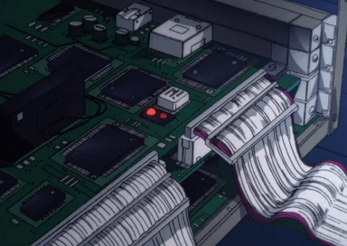

# TechSolutions - Сайт компании

  
**Официальный сайт компании TechSolutions**  
*Проект в рамках учебной практики*

## 📝 Описание
Сайт разработан как демонстрационный проект для учебной практик, предоставляющей комплексные технологические решения. Проект выполнен командой студентов ОмГТУ из трех человек в соответствии с требованиями учебной практики.

## 🚀 Особенности
- Чистая верстка без использования конструкторов
- Полностью адаптивный дизайн
- Современная цветовая схема
- Интерактивные элементы:
  - Плавная прокрутка
  - Анимированные карточки услуг
  - Интерактивная контактная форма
- Оптимизированная производительность
- Семантическая HTML-разметка

## 🛠 Технологии


## 📦 Установка и запуск
1. Клонировать репозиторий:
```bash
git clone https://github.com/yourusername/techsolutions-site.git
```
2. Запустить index.html в любом браузере